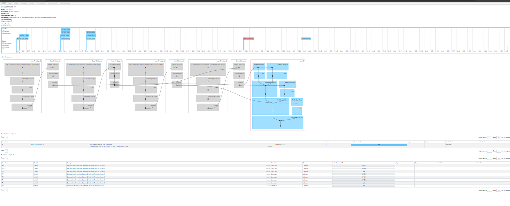

# How to Read Spark DAG (Directed Acyclic Graph)



## Table of Contents
1. [What is Spark DAG](#what-is-spark-dag)
2. [How to Read the DAG](#how-to-read-the-dag)
3. [Understanding DAG Components](#understanding-dag-components)
4. [Stage Analysis](#stage-analysis)
5. [Important Points in Each Stage](#important-points-in-each-stage)
6. [Performance Optimization Tips](#performance-optimization-tips)
7. [Common DAG Patterns](#common-dag-patterns)

## What is Spark DAG

A **Directed Acyclic Graph (DAG)** in Apache Spark represents the logical execution plan of your Spark application. It shows:
- The sequence of operations (transformations and actions)
- Dependencies between operations
- How data flows through your application
- Optimization opportunities applied by Catalyst optimizer

### Key Characteristics:
- **Directed**: Operations have a specific order and direction
- **Acyclic**: No circular dependencies (prevents infinite loops)
- **Graph**: Visual representation of data flow and dependencies

## How to Read the DAG

### 1. Reading Direction
- **Top to Bottom**: Data flows from source to sink
- **Left to Right**: In some visualizations, data flows horizontally
- **Node Connections**: Arrows show data dependency direction

### 2. Basic Reading Steps
1. **Start from Data Sources**: Identify input data (files, databases, streams)
2. **Follow the Flow**: Trace arrows to understand transformation sequence
3. **Identify Stages**: Look for stage boundaries (shuffle operations)
4. **Find Actions**: Locate terminal operations that trigger execution
5. **Spot Optimizations**: Notice where Catalyst has optimized operations

### 3. Visual Elements
```
┌─────────────┐    ┌─────────────┐    ┌─────────────┐
│   Source    │───▶│ Transform   │───▶│   Action    │
│  (RDD/DF)   │    │ (map/filter)│    │ (collect)   │
└─────────────┘    └─────────────┘    └─────────────┘
```

## Understanding DAG Components

### 1. Nodes (Operations)
#### Transformations (Lazy Operations)
- **Narrow Transformations**: `map()`, `filter()`, `select()`, `withColumn()`
- **Wide Transformations**: `groupBy()`, `join()`, `orderBy()`, `distinct()`

#### Actions (Eager Operations)
- **Collection Actions**: `collect()`, `take()`, `first()`
- **Aggregation Actions**: `count()`, `reduce()`, `aggregate()`
- **Output Actions**: `write()`, `save()`, `show()`

### 2. Edges (Dependencies)
- **Narrow Dependencies**: 1:1 or 1:many partition mapping
- **Wide Dependencies**: many:many partition mapping (shuffle required)

### 3. Stages
- **Stage Boundaries**: Created by wide transformations
- **Parallel Execution**: Operations within a stage run in parallel
- **Sequential Execution**: Stages execute sequentially

## Stage Analysis

### Stage Components
```
Stage N
├── Tasks: Number of parallel tasks
├── Duration: Time taken for stage completion
├── Input: Data size and partitions
├── Output: Data size and partitions
├── Shuffle Read: Data received from previous stage
└── Shuffle Write: Data sent to next stage
```

### Stage Types

#### 1. **ResultStage**
- Final stage in the DAG
- Contains the action that triggered execution
- Produces final output

#### 2. **ShuffleMapStage**
- Intermediate stages
- End with shuffle operations
- Produce intermediate results for next stage

### Stage Identification
- **Stage ID**: Sequential numbering (0, 1, 2, ...)
- **Stage Name**: Derived from the operation that defines the stage
- **Parent Stages**: Stages this stage depends on

## Important Points in Each Stage

### 1. **Input Analysis**
```markdown
📊 Input Metrics to Monitor:
- Records: Number of input records
- Size: Input data size (MB/GB)
- Partitions: Number of input partitions
- Sources: File formats, databases, or previous stages
```

### 2. **Processing Analysis**
```markdown
⚙️ Processing Metrics:
- Task Duration: Time each task takes
- Task Distribution: Even vs skewed task times
- CPU Utilization: Compute intensity
- Memory Usage: Peak memory consumption
- Spill: Disk spill due to memory pressure
```

### 3. **Output Analysis**
```markdown
📤 Output Metrics:
- Records Written: Number of output records
- Data Size: Output data volume
- Partitions: Output partition count
- Shuffle Data: Data prepared for next stage
```

### 4. **Performance Indicators**

#### 🟢 Good Performance Indicators
- Balanced task durations across executors
- Minimal data spill to disk
- High CPU utilization
- Appropriate partition sizes (100MB-200MB per partition)
- Low shuffle overhead

#### 🔴 Performance Issues
- Skewed task durations (some tasks much slower)
- High shuffle read/write volumes
- Memory spills to disk
- Too many small partitions (< 10MB)
- Too few large partitions (> 1GB)

## Performance Optimization Tips

### 1. **Partition Optimization**
```python
# Check current partitions
df.rdd.getNumPartitions()

# Repartition for better parallelism
df_optimized = df.repartition(200)

# Coalesce to reduce partitions
df_reduced = df.coalesce(50)
```

### 2. **Caching Strategy**
```python
# Cache frequently accessed DataFrames
df.cache()  # Memory only
df.persist(StorageLevel.MEMORY_AND_DISK)  # Memory + Disk fallback
```

### 3. **Join Optimization**
```python
# Broadcast small tables
from pyspark.sql.functions import broadcast
large_df.join(broadcast(small_df), "key")

# Use appropriate join types
df1.join(df2, "key", "left_outer")
```

### 4. **Shuffle Optimization**
```python
# Pre-partition data for joins
df1_partitioned = df1.repartition("join_key")
df2_partitioned = df2.repartition("join_key")

# Use bucketing for repeated joins
df.write.bucketBy(10, "join_key").saveAsTable("bucketed_table")
```

## Common DAG Patterns

### 1. **Linear Pipeline**
```
Source → Filter → Map → Aggregate → Write
```
- Simple sequential processing
- Each stage depends on previous
- Good for ETL workflows

### 2. **Fan-Out Pattern**
```
     Source
    /   |   \
Filter  Map  Select
   \    |    /
    \   |   /
     Union
```
- Multiple transformations from same source
- Parallel processing branches
- Common in feature engineering

### 3. **Join Pattern**
```
Source A    Source B
   |           |
Transform   Transform
   \          /
    \        /
      Join
       |
   Aggregate
```
- Combining multiple data sources
- Often creates wide dependencies
- Requires shuffle operations

### 4. **Iterative Pattern**
```
Initial Data → Process → Check Condition
                ↑            |
                └── Loop ←───┘
```
- Machine learning algorithms
- Convergence-based processing
- Multiple DAG executions

## DAG Reading Checklist

### Before Execution
- [ ] Identify all data sources and their sizes
- [ ] Count expected stages based on wide transformations
- [ ] Estimate shuffle operations and their impact
- [ ] Plan caching for reused DataFrames

### During Execution
- [ ] Monitor stage progress and task distribution
- [ ] Watch for skewed tasks or stages
- [ ] Check memory usage and spill metrics
- [ ] Observe shuffle read/write volumes

### After Execution
- [ ] Analyze total execution time per stage
- [ ] Review resource utilization efficiency
- [ ] Identify optimization opportunities
- [ ] Document performance baselines

## Advanced DAG Analysis

### 1. **Critical Path Analysis**
- Identify the longest stage chain
- Focus optimization on critical path stages
- Parallel stages don't affect total time

### 2. **Resource Bottleneck Detection**
```markdown
CPU Bound: High CPU utilization, low I/O wait
I/O Bound: High disk/network activity, low CPU
Memory Bound: Frequent spilling, high GC time
Shuffle Bound: High shuffle times, network bottleneck
```

### 3. **Catalyst Optimizer Impact**
- **Predicate Pushdown**: Filters moved closer to source
- **Column Pruning**: Only required columns read
- **Constant Folding**: Compile-time expression evaluation
- **Join Reordering**: Optimal join sequence

## Troubleshooting Common Issues

### 1. **Stage Skew**
```python
# Check partition distribution
df.groupBy(spark_partition_id()).count().show()

# Fix with salting technique
from pyspark.sql.functions import rand, concat, lit
df_salted = df.withColumn("salt", (rand() * 10).cast("int"))
df_salted = df_salted.withColumn("salted_key", concat(col("key"), lit("_"), col("salt")))
```

### 2. **Memory Issues**
```python
# Increase executor memory
spark.conf.set("spark.executor.memory", "4g")
spark.conf.set("spark.executor.memoryFraction", "0.8")

# Optimize serialization
spark.conf.set("spark.serializer", "org.apache.spark.serializer.KryoSerializer")
```

### 3. **Shuffle Problems**
```python
# Increase shuffle partitions for large datasets
spark.conf.set("spark.sql.shuffle.partitions", "400")

# Use appropriate data formats
df.write.parquet("path/to/parquet")  # Better than CSV for large data
```

## Complex DAG Example: E-commerce Analytics Pipeline

Let's analyze a comprehensive real-world example that demonstrates all major DAG concepts, node types, and optimization opportunities.

### Business Scenario
An e-commerce company wants to generate a daily sales report that includes:
- Customer segmentation analysis
- Product performance metrics
- Geographic sales distribution
- Revenue trends with recommendations

### Code Example
```python
from pyspark.sql import SparkSession
from pyspark.sql.functions import *
from pyspark.sql.types import *

# Initialize Spark
spark = SparkSession.builder \
    .appName("ECommerceAnalytics") \
    .config("spark.sql.adaptive.enabled", "true") \
    .config("spark.sql.adaptive.coalescePartitions.enabled", "true") \
    .getOrCreate()

# 1. DATA SOURCES (Multiple Sources)
orders_df = spark.read.parquet("s3://data-lake/orders/") \
    .filter(col("order_date") >= "2024-01-01")

customers_df = spark.read.jdbc(
    url="jdbc:mysql://db.company.com:3306/crm",
    table="customers",
    properties={"user": "spark", "password": "***"}
)

products_df = spark.read.json("s3://data-lake/products/")

geo_mapping = spark.read.csv("s3://data-lake/lookup/geo_mapping.csv", header=True)

# 2. DATA CLEANING & TRANSFORMATION
# Clean orders data
clean_orders = orders_df \
    .filter(col("amount") > 0) \
    .filter(col("status") == "completed") \
    .withColumn("order_year", year(col("order_date"))) \
    .withColumn("order_month", month(col("order_date"))) \
    .drop("internal_notes", "temp_id")

# Enrich customer data
enriched_customers = customers_df \
    .withColumn("age_group", 
        when(col("age") < 25, "Young")
        .when(col("age") < 45, "Adult")
        .otherwise("Senior")) \
    .withColumn("customer_value", 
        when(col("lifetime_value") > 10000, "High")
        .when(col("lifetime_value") > 1000, "Medium")
        .otherwise("Low"))

# 3. JOINS (Different Join Types)
# Main fact table creation
fact_sales = clean_orders \
    .join(enriched_customers, "customer_id", "left") \
    .join(products_df, "product_id", "left") \
    .join(broadcast(geo_mapping), "zip_code", "left")

# 4. AGGREGATIONS & WINDOW FUNCTIONS
# Customer Analytics
customer_metrics = fact_sales \
    .groupBy("customer_id", "age_group", "customer_value") \
    .agg(
        sum("amount").alias("total_spent"),
        count("order_id").alias("order_count"),
        avg("amount").alias("avg_order_value"),
        max("order_date").alias("last_order_date")
    ) \
    .withColumn("recency_days", 
        datediff(current_date(), col("last_order_date")))

# Product Performance with Rankings
window_spec = Window.partitionBy("category").orderBy(desc("revenue"))
product_performance = fact_sales \
    .groupBy("product_id", "product_name", "category") \
    .agg(sum("amount").alias("revenue"),
         count("order_id").alias("sales_count")) \
    .withColumn("category_rank", row_number().over(window_spec)) \
    .filter(col("category_rank") <= 10)

# Geographic Analysis
geo_analysis = fact_sales \
    .groupBy("state", "city", "region") \
    .agg(
        sum("amount").alias("total_revenue"),
        countDistinct("customer_id").alias("unique_customers"),
        avg("amount").alias("avg_transaction")
    ) \
    .orderBy(desc("total_revenue"))

# 5. COMPLEX ANALYTICS
# Time Series Analysis with LAG function
monthly_window = Window.orderBy("year", "month")
revenue_trends = fact_sales \
    .groupBy(year("order_date").alias("year"), 
             month("order_date").alias("month")) \
    .agg(sum("amount").alias("monthly_revenue")) \
    .withColumn("prev_month_revenue", 
        lag("monthly_revenue", 1).over(monthly_window)) \
    .withColumn("growth_rate", 
        (col("monthly_revenue") - col("prev_month_revenue")) / 
        col("prev_month_revenue") * 100)

# 6. MACHINE LEARNING FEATURES
# Customer RFM Analysis (Recency, Frequency, Monetary)
rfm_analysis = customer_metrics \
    .withColumn("frequency_score", 
        ntile(5).over(Window.orderBy("order_count"))) \
    .withColumn("monetary_score", 
        ntile(5).over(Window.orderBy("total_spent"))) \
    .withColumn("recency_score", 
        ntile(5).over(Window.orderBy(desc("recency_days"))))

# Cache frequently used DataFrames
fact_sales.cache()
customer_metrics.cache()

# 7. MULTIPLE OUTPUTS
# Write results to different destinations
customer_metrics.write.mode("overwrite") \
    .parquet("s3://analytics/customer_segments/")

product_performance.write.mode("overwrite") \
    .partitionBy("category") \
    .parquet("s3://analytics/product_performance/")

geo_analysis.coalesce(1).write.mode("overwrite") \
    .option("header", "true") \
    .csv("s3://reports/geographic_analysis/")

revenue_trends.write.mode("overwrite") \
    .saveAsTable("analytics.revenue_trends")

# Final dashboard data
dashboard_summary = rfm_analysis \
    .groupBy("frequency_score", "monetary_score", "recency_score") \
    .agg(count("customer_id").alias("customer_count"),
         avg("total_spent").alias("avg_customer_value")) \
    .collect()  # Action that triggers execution

print(f"Dashboard data generated with {len(dashboard_summary)} segments")
```

### DAG Visualization

```
                                    ┌─────────────────┐
                                    │  orders.parquet │ 
                                    │   (Stage 0)     │
                                    └─────────┬───────┘
                                              │
                                    ┌─────────▼───────┐
                              ┌────▶│   filter +      │
                              │     │  withColumn     │
                              │     │  (Stage 0)      │
┌─────────────────┐           │     └─────────┬───────┘
│ customers.jdbc  │           │               │
│   (Stage 1)     │           │     ┌─────────▼───────┐      ┌─────────────────┐
└─────────┬───────┘           │     │  clean_orders   │      │ products.json   │
          │                   │     │   (Stage 0)     │      │   (Stage 2)     │
┌─────────▼───────┐           │     └─────────┬───────┘      └─────────┬───────┘
│  withColumn +   │───────────┘               │                        │
│   age_group     │                           │              ┌─────────▼───────┐
│  (Stage 1)      │                           │              │   products_df   │
└─────────┬───────┘                           │              │   (Stage 2)     │
          │                                   │              └─────────┬───────┘
┌─────────▼───────┐                           │                        │
│enriched_customers│                          │                        │
│   (Stage 1)     │                           │                        │
└─────────┬───────┘                           │                        │
          │                                   │                        │
          │           ┌─────────────────┐     │                        │
          │           │ geo_mapping.csv │     │                        │
          │           │   (Stage 3)     │     │                        │
          │           └─────────┬───────┘     │                        │
          │                     │             │                        │
          │                     ▼             │                        │
          │           ┌─────────────────┐     │                        │
          │           │ broadcast       │     │                        │
          │           │ (Stage 3)       │     │                        │
          │           └─────────┬───────┘     │                        │
          │                     │             │                        │
          └─────────────────────┼─────────────┼────────────────────────┘
                                │             │
                                ▼             ▼
                      ┌─────────────────────────────────┐
                      │         JOIN OPERATIONS         │
                      │        (Stage 4 - SHUFFLE)      │
                      │   left join + left join +       │
                      │        broadcast join           │
                      └─────────────────┬───────────────┘
                                        │
                                        ▼
                                ┌───────────────┐
                                │  fact_sales   │
                                │  (.cache())   │
                                │  (Stage 4)    │
                                └───┬───────┬───┘
                                    │       │
                    ┌───────────────┘       └───────────────┐
                    ▼                                       ▼
        ┌─────────────────────┐                 ┌─────────────────────┐
        │   groupBy + agg     │                 │   groupBy + agg +   │
        │ customer_metrics    │                 │   window function   │
        │  (Stage 5-SHUFFLE)  │                 │ product_performance │
        └─────────┬───────────┘                 │  (Stage 6-SHUFFLE)  │
                  │                             └─────────┬───────────┘
                  ▼                                       │
        ┌─────────────────────┐                          │
        │    .cache() +       │                          │
        │   withColumn        │                          │
        │   (Stage 5)         │                          │
        └─────────┬───────────┘                          │
                  │                                      │
                  └──────────────┬───────────────────────┘
                                 │
                                 ▼
                    ┌─────────────────────────────────┐
                    │       WINDOW OPERATIONS         │
                    │      (Stage 7 - SHUFFLE)        │
                    │  ntile() + lag() functions      │
                    └─────────────────┬───────────────┘
                                      │
                                      ▼
                          ┌─────────────────────┐
                          │   rfm_analysis +    │
                          │   groupBy + agg     │
                          │  (Stage 8-SHUFFLE)  │
                          └─────────┬───────────┘
                                    │
                                    ▼
                          ┌─────────────────────┐
                          │     collect()       │
                          │   (Stage 9 -        │
                          │   RESULT STAGE)     │
                          └─────────────────────┘
```

### Node-Level Breakdown

#### **Stage 0: Data Ingestion & Initial Processing**
```yaml
Stage ID: 0
Stage Type: ShuffleMapStage
Description: "parquet scan + filter + withColumn"

Nodes:
  - FileScan parquet:
      Properties:
        - Input: s3://data-lake/orders/
        - Partitions: 450 files
        - Size: 12.5 GB
        - Format: Parquet (columnar)
        - Predicate Pushdown: order_date >= '2024-01-01'
      
  - Filter:
      Properties:
        - Condition: (amount > 0) AND (status = 'completed')
        - Selectivity: 85% (15% filtered out)
        - Operation Type: Narrow transformation
        
  - Project (withColumn):
      Properties:
        - New Columns: order_year, order_month
        - Dropped Columns: internal_notes, temp_id
        - Column Pruning: Applied by Catalyst
        
Performance Metrics:
  - Duration: 45 seconds
  - Input Records: 50M records
  - Output Records: 42.5M records  
  - Tasks: 450 tasks (1 per file)
  - Memory Usage: 2.1 GB per executor
```

#### **Stage 1: Customer Data Processing**
```yaml
Stage ID: 1
Stage Type: ShuffleMapStage
Description: "jdbc scan + transformations"

Nodes:
  - JDBCScan:
      Properties:
        - Source: MySQL Database
        - Table: customers
        - Partitions: 8 (based on customer_id hash)
        - Fetch Size: 10000 rows per fetch
        - Connection Pool: 4 connections
        
  - Project (withColumn):
      Properties:
        - Derived Columns: age_group, customer_value
        - Case/When Expressions: 2 complex conditions
        - Null Handling: Handled by otherwise clause

Performance Metrics:
  - Duration: 12 seconds
  - Input Records: 2.5M records
  - Output Records: 2.5M records
  - Network I/O: 450 MB transferred
  - JDBC Connection Time: 2.1 seconds
```

#### **Stage 2: Product Metadata Loading**
```yaml
Stage ID: 2
Stage Type: ShuffleMapStage
Description: "json scan + schema inference"

Nodes:
  - FileScan json:
      Properties:
        - Input: s3://data-lake/products/
        - Schema Inference: Enabled
        - Multiline: False
        - Compression: None
        - Partitions: 25 files
        
Performance Metrics:
  - Duration: 8 seconds
  - Input Records: 150K records
  - File Size: 85 MB
  - Schema Inference Time: 1.2 seconds
```

#### **Stage 3: Lookup Table (Broadcast)**
```yaml
Stage ID: 3
Stage Type: BroadcastExchange
Description: "csv scan + broadcast preparation"

Nodes:
  - FileScan csv:
      Properties:
        - Input: s3://data-lake/lookup/geo_mapping.csv
        - Header: True
        - Delimiter: ","
        - Size: 2.5 MB
        
  - BroadcastExchange:
      Properties:
        - Broadcast Size: 2.5 MB
        - Broadcast Time: 0.8 seconds
        - Target Executors: 20 executors
        - Serialization: Kryo

Performance Metrics:
  - Duration: 3 seconds
  - Input Records: 50K records
  - Broadcast Distribution Time: 0.8 seconds
  - Memory per Executor: 2.5 MB
```

#### **Stage 4: Complex Join Operations (SHUFFLE)**
```yaml
Stage ID: 4
Stage Type: ShuffleMapStage  
Description: "multiple joins with different strategies"

Nodes:
  - SortMergeJoin (orders + customers):
      Properties:
        - Join Type: Left Join
        - Join Keys: customer_id
        - Sort Required: True
        - Spill Threshold: 200MB
        
  - SortMergeJoin (result + products):
      Properties:
        - Join Type: Left Join  
        - Join Keys: product_id
        - Build Side: Right (smaller)
        
  - BroadcastHashJoin (result + geo_mapping):
      Properties:
        - Join Type: Left Join
        - Join Keys: zip_code
        - Broadcast Side: Right
        - Hash Table Size: 2.5 MB

Shuffle Metrics:
  - Shuffle Write: 8.5 GB
  - Shuffle Read: 8.5 GB  
  - Partitions: 200
  - Spill to Disk: 1.2 GB
  - Network Transfer Time: 15 seconds

Performance Metrics:
  - Duration: 85 seconds (longest stage)
  - Input Records: 45M records (total from all sources)
  - Output Records: 41.2M records
  - Tasks: 200 tasks
  - Peak Memory: 4.2 GB per executor
```

#### **Stage 5: Customer Aggregations (SHUFFLE)**
```yaml
Stage ID: 5
Stage Type: ShuffleMapStage
Description: "groupBy aggregations + caching"

Nodes:
  - HashAggregate (partial):
      Properties:
        - Grouping Keys: customer_id, age_group, customer_value
        - Aggregations: sum, count, avg, max
        - Partial Results: True
        - Hash Table Size: 150 MB per task
        
  - Exchange (Shuffle):
      Properties:
        - Partitioning: HashPartitioning(customer_id)
        - Shuffle Partitions: 200
        - Compression: LZ4
        
  - HashAggregate (final):
      Properties:
        - Final Aggregation: True
        - Merge Strategy: Hash-based
        
  - InMemoryTableScan:
      Properties:
        - Cache Level: MEMORY_ONLY
        - Compression: Enabled
        - Cached Size: 850 MB

Performance Metrics:
  - Duration: 32 seconds
  - Input Records: 41.2M records
  - Output Records: 2.1M records (high aggregation)
  - Reduction Ratio: 95.9%
  - Cache Write Time: 4.2 seconds
```

#### **Stage 6: Product Analytics with Windows (SHUFFLE)**
```yaml
Stage ID: 6
Stage Type: ShuffleMapStage
Description: "groupBy + window function + filter"

Nodes:
  - HashAggregate:
      Properties:
        - Grouping: product_id, product_name, category
        - Aggregations: sum(amount), count(order_id)
        
  - Window:
      Properties:
        - Window Function: row_number()
        - Partition By: category  
        - Order By: revenue DESC
        - Window Type: Ranking
        
  - Filter:
      Properties:
        - Condition: category_rank <= 10
        - Applied After: Window calculation
        - Selectivity: 15% (top 10 per category)

Performance Metrics:
  - Duration: 28 seconds
  - Window Partitions: 45 categories
  - Memory for Sorting: 1.8 GB per partition
  - Output Records: 450 records (10 per category)
```

#### **Stage 7: Time Series with LAG (SHUFFLE)**
```yaml
Stage ID: 7  
Stage Type: ShuffleMapStage
Description: "temporal grouping + lag window function"

Nodes:
  - HashAggregate:
      Properties:
        - Grouping: year(order_date), month(order_date) 
        - Temporal Partitioning: Monthly buckets
        
  - Window (LAG):
      Properties:
        - Window Function: lag(monthly_revenue, 1)
        - Partition By: None (global ordering)
        - Order By: year, month
        - Frame: UNBOUNDED PRECEDING to CURRENT ROW
        
  - Project:
      Properties:
        - Calculated Columns: growth_rate
        - Mathematical Operations: Division, multiplication

Performance Metrics:
  - Duration: 18 seconds  
  - Temporal Buckets: 36 months
  - Global Sort Required: Yes
  - Memory for Window: 500 MB
```

#### **Stage 8: RFM Analysis (SHUFFLE)**
```yaml
Stage ID: 8
Stage Type: ShuffleMapStage  
Description: "multiple ntile window functions"

Nodes:
  - Window (frequency_score):
      Properties:
        - Function: ntile(5)
        - Order By: order_count
        - Global Ranking: Required
        
  - Window (monetary_score):
      Properties:
        - Function: ntile(5)  
        - Order By: total_spent
        - Quintile Calculation: 5 buckets
        
  - Window (recency_score):
      Properties:
        - Function: ntile(5)
        - Order By: recency_days DESC
        - Reverse Ordering: Recent = High score

Performance Metrics:
  - Duration: 22 seconds
  - Multiple Sorts: 3 different orderings
  - Memory for Ranking: 2.1 GB
  - Quintile Distribution: Even 20% splits
```

#### **Stage 9: Final Collection (RESULT STAGE)**
```yaml
Stage ID: 9
Stage Type: ResultStage
Description: "final aggregation + collect action"

Nodes:
  - HashAggregate:
      Properties:
        - Grouping: frequency_score, monetary_score, recency_score
        - Final Aggregation: count, avg
        - Result Size: 125 combinations (5³)
        
  - CollectLimit:
      Properties:
        - Action Type: collect()
        - Driver Memory Impact: 45 KB
        - Network Transfer: All results to driver

Performance Metrics:
  - Duration: 3 seconds
  - Result Records: 125 records
  - Driver Collection Time: 0.5 seconds
  - Memory on Driver: 45 KB
```

### How to Read This Complex DAG

#### 1. **Execution Flow Analysis**
```
Reading Steps:
1. Start with data sources (Stages 0-3) - parallel loading
2. Identify the critical join stage (Stage 4) - bottleneck
3. Follow the branching after joins - parallel analytics paths  
4. Notice caching points - performance optimization
5. Trace window operations - expensive computations
6. End with action - final result collection
```

#### 2. **Performance Bottleneck Identification**
```
Critical Path Analysis:
Stage 0 (45s) → Stage 4 (85s) → Stage 5 (32s) → Stage 8 (22s) → Stage 9 (3s)
Total: 187 seconds

Bottlenecks:
- Stage 4: Complex joins with shuffle (45% of total time)
- Stage 0: Large data scan (24% of total time)  
- Stage 5: High cardinality aggregation (17% of total time)

Optimization Opportunities:
- Partition pruning on Stage 0
- Broadcast join optimization in Stage 4
- Pre-aggregation before Stage 5
```

#### 3. **Resource Utilization Patterns**
```yaml
Memory Usage by Stage:
  Stage 0: 2.1 GB (File scanning)
  Stage 4: 4.2 GB (Join operations) ⚠️ Peak usage
  Stage 5: 1.8 GB (Aggregation + Cache)
  Stage 8: 2.1 GB (Multiple windows)

Shuffle Operations:
  Stage 4: 8.5 GB (Join shuffle) ⚠️ Highest shuffle
  Stage 5: 3.2 GB (Group by shuffle)  
  Stage 7: 1.1 GB (Window shuffle)
  Stage 8: 2.8 GB (Ranking shuffle)

Network I/O:
  Total Shuffle Read/Write: 32.2 GB
  Broadcast Distribution: 2.5 MB × 20 executors = 50 MB
  JDBC Network: 450 MB
```

#### 4. **Optimization Recommendations**

Based on this DAG analysis:

```python
# 1. Optimize joins with better partitioning
fact_sales_optimized = clean_orders \
    .repartition(col("customer_id")) \  # Pre-partition for join
    .join(enriched_customers.repartition(col("customer_id")), "customer_id") \
    .join(products_df.repartition(col("product_id")), "product_id") \
    .join(broadcast(geo_mapping), "zip_code")

# 2. Cache intermediate results strategically  
clean_orders.cache()  # Used multiple times
enriched_customers.cache()  # Referenced in multiple branches

# 3. Optimize aggregations with pre-filtering
customer_metrics = fact_sales \
    .filter(col("amount") > 10)  # Filter before expensive aggregation \
    .groupBy("customer_id", "age_group", "customer_value") \
    .agg(...)

# 4. Tune shuffle partitions based on data size
spark.conf.set("spark.sql.shuffle.partitions", "400")  # Increase for large data
```

## Best Practices Summary

1. **Always analyze your DAG** before running large jobs
2. **Cache strategically** - only cache DataFrames used multiple times  
3. **Partition wisely** - aim for 100-200MB per partition
4. **Minimize shuffles** - use broadcast joins for small tables
5. **Monitor continuously** - use Spark UI during execution
6. **Optimize iteratively** - measure impact of each change
7. **Document patterns** - record successful optimization strategies

---

*Remember: Understanding your DAG is key to Spark performance optimization. Spend time analyzing the execution plan before scaling to production workloads.*
