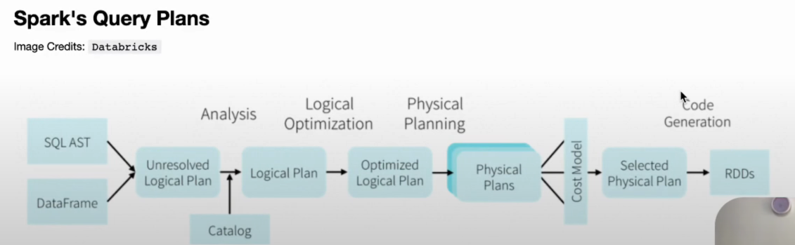

# Complete Guide to Spark Query Plans Analysis 🚀

## 📚 Table of Contents
1. [Introduction & Prerequisites](#introduction--prerequisites)
2. [Fundamentals: Query Execution Pipeline](#fundamentals-query-execution-pipeline)
3. [Understanding Physical Plans](#understanding-physical-plans)
4. [Hands-On: Reading Query Plans](#hands-on-reading-query-plans)
5. [Catalyst Optimizer Deep Dive](#catalyst-optimizer-deep-dive)
6. [Advanced Optimization Techniques](#advanced-optimization-techniques)
7. [Performance Troubleshooting](#performance-troubleshooting)
8. [Essential Spark Configurations](#essential-spark-configurations)
9. [Quick Reference Guide](#quick-reference-guide)

---

## 1. Introduction & Prerequisites 📖

### What This Guide Covers
This comprehensive guide teaches you how to **read, analyze, and optimize** Apache Spark query plans for maximum performance. You'll learn to identify bottlenecks, understand optimization strategies, and configure Spark for optimal query execution.

### Learning Path
```
Beginner → Intermediate → Advanced → Expert
    ↓           ↓           ↓        ↓
Concepts → Read Plans → Optimize → Troubleshoot
```

### Prerequisites
- Basic SQL knowledge
- Understanding of distributed computing concepts
- Familiarity with Spark DataFrames/SQL
- Access to Spark environment (local or cluster)



---

## 2. Fundamentals: Query Execution Pipeline 📋

### Overview: From SQL to Results
Understanding how Spark processes queries is essential for optimization. Every query goes through 8 distinct phases:

### The 8-Phase Execution Pipeline

```
SQL Query → [Parse] → [Analyze] → [Optimize] → [Plan] → [Select] → [Execute] → Results
    ↓         ↓         ↓          ↓         ↓        ↓         ↓
   AST    Unresolved  Resolved   Optimized Physical  Best     RDD
          Logical     Logical    Logical   Plans     Plan     Ops
```

### 1. SQL Parsing (AST Generation) 🔍
- **Purpose**: Parse SQL text into an Abstract Syntax Tree (AST)
- **What happens**: 
  - Spark first checks for **syntactical errors** in the SQL query
  - Converts SQL string into a structured tree representation
  - Validates basic SQL grammar and structure
- **Example**: 
  ```sql
  SELECT name, age FROM users WHERE age > 25
  ```
  Gets parsed into an AST with SELECT, FROM, WHERE nodes

### 2. Unresolved Logical Plan(Parsed Logical Plan) Creation 📋
- **Purpose**: Convert AST into a logical plan structure
- **What happens**: 
  - Creates a tree of logical operators (Project, Filter, Join, etc.)
  - Column names and table references are **not yet validated**
  - No schema information attached yet
- **Example Output**: 
  ```
  Project [name, age]
  +- Filter (age > 25)
     +- UnresolvedRelation [users]
  ```

### 3. Catalog Resolution & Logical Plan Resolution(Analyzed Logical Plan) 🗂️
- **Purpose**: Resolve all references using Spark's metadata catalog
- **What happens**: 
  - **Catalog** contains metadata about tables, columns, data types, and locations
  - Validates that tables and columns actually exist
  - Assigns proper data types to columns
  - Resolves function references
- **Key Components**:
  - **Hive Metastore** or **Spark Catalog** for table metadata
  - **Data source information** (Parquet, Delta, Hive, etc.)
- **Example Output**: 
  ```
  Project [name#1: string, age#2: int]
  +- Filter (age#2 > 25)
     +- Relation [users] (name#1, age#2, city#3)
  ```

### 4. Catalyst Optimizer - Logical Plan Optimization 🚀
- **Purpose**: Apply rule-based optimizations to improve query efficiency
- **Key Optimization Rules**:
  - **Predicate Pushdown**: Move filters closer to data source
  - **Projection Pushdown**: Only read required columns
  - **Constant Folding**: Evaluate constant expressions at compile time
  - **Join Reordering**: Optimize join order based on statistics
  - **Partition Pruning**: Skip irrelevant partitions
- **Example Transformations**:
  ```sql
  -- Before Optimization
  SELECT name FROM (SELECT * FROM users WHERE age > 25) WHERE city = 'NYC'
  
  -- After Optimization (Combined Filters + Projection Pushdown)
  SELECT name FROM users WHERE age > 25 AND city = 'NYC'
  ```

### 5. Physical Plan Generation 🏗️
- **Purpose**: Convert optimized logical plan into executable physical operations
- **What happens**: 
  - Generate **multiple physical plan alternatives** for the same logical plan
  - Each physical plan represents different execution strategies
- **Physical Operators Examples**:
  - `HashJoin` vs `SortMergeJoin` vs `BroadcastHashJoin`
  - `FileScan` vs `InMemoryTableScan`
  - Different partitioning strategies

### 6. Cost-Based Optimization (CBO) 💰
- **Purpose**: Select the most efficient physical plan using statistics
- **Cost Model Factors**:
  - **Table size statistics** (row count, data size)
  - **Column statistics** (distinct values, null count, min/max)
  - **Network I/O costs**
  - **CPU processing costs**
  - **Memory usage estimates**
- **Example Decision**:
  ```
  Small table (< spark.sql.adaptive.autoBroadcastJoinThreshold)
  → Choose BroadcastHashJoin instead of SortMergeJoin
  ```

### 7. Physical Plan Execution 🔥
- **Purpose**: Execute the selected physical plan using RDD operations
- **Reading the Physical Plan**: The Physical Plan can be analyzed by reading it **from bottom to top**. This approach helps in understanding how Spark processes the data step by step, starting from the data source and moving towards the final output.
- **Execution Details**:
  - Convert physical operators into **RDD transformations and actions**
  - Apply **Adaptive Query Execution (AQE)** for runtime optimizations
  - Utilize **code generation** for performance
  - Handle **dynamic partition pruning** and **dynamic coalescing**

### 8. Built-in Iterative Processing 🔄
- **Purpose**: Handle iterative algorithms and streaming efficiently
- **Features**:
  - **Catalyst optimizer** works iteratively to apply all rules
  - **Tungsten execution engine** for memory management
  - **Whole-stage code generation** for tight loops
- **Example Use Cases**:
  - Machine learning iterations (MLlib)
  - Graph processing (GraphX)
  - Streaming micro-batches

---

## 3. Understanding Physical Plans 🏗️

Physical plans represent the **actual execution strategy** that Spark will use. Learning to read them is crucial for performance optimization.

### Why Physical Plans Matter
- **Performance Bottlenecks**: Identify expensive operations
- **Resource Usage**: Understand memory and CPU requirements  
- **Optimization Verification**: Confirm Catalyst optimizations
- **Debugging**: Troubleshoot query performance issues

## Physical Plan Components

### Common Physical Operators
- **FileScan**: Reading from storage (Parquet, Delta, etc.)
- **Filter**: WHERE clause conditions
- **Project**: SELECT column projections
- **Exchange**: Data shuffle between partitions
- **HashJoin/SortMergeJoin**: JOIN operations
- **HashAggregate**: GROUP BY aggregations
- **Sort**: ORDER BY operations
- **BroadcastExchange**: Broadcasting small tables

### Exchange Algorithms & Partitioning Strategies

#### **Hash Partitioning (`hashpartitioning`)**
```
Exchange hashpartitioning(department_name#45, 200), ENSURE_REQUIREMENTS, [id=#234]
```
- **Purpose**: Distributes data based on hash of key columns
- **Use Case**: GROUP BY, JOIN operations, DISTINCT
- **Algorithm**: `hash(key) % numPartitions`
- **Guarantees**: Records with same key go to same partition

#### **Range Partitioning (`rangepartitioning`)**
```
Exchange rangepartitioning(avg_salary#123 DESC NULLS LAST, 200), ENSURE_REQUIREMENTS
```
- **Purpose**: Distributes data based on value ranges
- **Use Case**: ORDER BY, SORT operations, range-based queries
- **Algorithm**: Divides value space into ranges, assigns partitions
- **Guarantees**: Globally sorted data across partitions

#### **Broadcast Exchange (`BroadcastExchange`)**
```
BroadcastExchange HashedRelationBroadcastMode(List(input[0, int, false]), false)
```
- **Purpose**: Copies small dataset to all executors
- **Use Case**: Broadcast joins with small tables
- **Threshold**: `spark.sql.adaptive.autoBroadcastJoinThreshold` (default: 10MB)

#### **Other Exchange Types**
- **Round Robin**: Even distribution across partitions
- **Single Partition**: Collects all data into one partition (potential bottleneck)
- **Custom Partitioning**: User-defined partitioning logic

---

## 3. Practical Analysis 📖

### Query Plan Analysis Commands

### View Different Plan Stages
```python
# Show logical plan
df.explain(mode="simple")     # Basic physical plan
df.explain(mode="extended")   # Logical + Physical plans
df.explain(mode="codegen")    # Generated code
df.explain(mode="cost")       # Cost information
df.explain(mode="formatted")  # Pretty formatted output

# SQL equivalent
spark.sql("EXPLAIN SELECT * FROM table").show()
```

### Enable Cost-Based Optimization
```python
# Enable CBO and collect statistics
spark.conf.set("spark.sql.cbo.enabled", "true")
spark.conf.set("spark.sql.cbo.joinReorder.enabled", "true")

# Collect table statistics
spark.sql("ANALYZE TABLE users COMPUTE STATISTICS")
spark.sql("ANALYZE TABLE users COMPUTE STATISTICS FOR COLUMNS name, age")
```

### How to Read Physical Plans (Bottom-Up Approach) 📖

### Sample Query Example
```sql
SELECT 
    d.department_name,
    AVG(e.salary) as avg_salary,
    COUNT(*) as emp_count
FROM employees e
JOIN departments d ON e.dept_id = d.dept_id
WHERE e.salary > 50000
GROUP BY d.department_name
ORDER BY avg_salary DESC
```

### Physical Plan Output (Read Bottom to Top ⬆️)
```
== Physical Plan ==
AdaptiveSparkPlan isFinalPlan=false
+- Sort [avg_salary#123 DESC NULLS LAST], true, 0
   +- Exchange rangepartitioning(avg_salary#123 DESC NULLS LAST, 200), ENSURE_REQUIREMENTS, [id=#456]
      +- HashAggregate(keys=[department_name#45], functions=[avg(salary#12), count(1)])
         +-  Exchange hashpartitioning(department_name#45, 200), ENSURE_REQUIREMENTS, [id=#234]
            +- HashAggregate(keys=[department_name#45], functions=[partial_avg(salary#12), partial_count(1)])
               +- Project [department_name#45, salary#12]
                  +- BroadcastHashJoin [dept_id#34], [dept_id#67], Inner, BuildRight, false
                     :- Project [dept_id#34, salary#12]
                     :  +- Filter (isnotnull(salary#12) AND (salary#12 > 50000))
                     :     +- FileScan parquet employees[dept_id#34, salary#12] 
                     +- BroadcastExchange HashedRelationBroadcastMode(List(input[0, int, false]), false), [id=#123]
                        +- Project [dept_id#67, department_name#45]
                           +- FileScan parquet departments[dept_id#67, department_name#45]
```

### Step-by-Step Execution Flow (Bottom → Top)

#### **Step 1: Data Sources (Bottom Level)**
- **`FileScan parquet departments`**: Reads department data from Parquet files
- **`FileScan parquet employees`**: Reads employee data from Parquet files
- **Key Info**: Shows file format, columns read, and any partition pruning

#### **Step 2: Early Filtering & Projection**
- **`Filter (salary#12 > 50000)`**: Applies WHERE clause filter early (predicate pushdown)
- **`Project [dept_id#34, salary#12]`**: Selects only required columns (projection pushdown)
- **Optimization**: Reduces data volume early in the pipeline

#### **Step 3: Broadcast Preparation**
- **`BroadcastExchange`**: Smaller departments table is broadcast to all nodes
- **`Project [dept_id#67, department_name#45]`**: Prepares join columns
- **Why Broadcast**: Departments table is small enough to fit in memory on each executor

#### **Step 4: Join Operation**
- **`BroadcastHashJoin [dept_id#34], [dept_id#67]`**: 
  - Joins employees with broadcasted departments
  - **BuildRight**: Departments table becomes the hash table
  - **Inner**: Only matching records are kept

#### **Step 5: Partial Aggregation (Local)**
- **`HashAggregate(partial_avg, partial_count)`**: 
  - Pre-aggregates data locally on each partition
  - Reduces data shuffled across network
  - Computes partial sums and counts

#### **Step 6: Shuffle for Grouping**
- **`Exchange hashpartitioning(department_name#45, 200)`**:
  - Redistributes data by department_name
  - Ensures all records for same department go to same partition
  - **200**: Number of shuffle partitions

#### **Step 7: Final Aggregation**
- **`HashAggregate(avg(salary), count(1))`**:
  - Combines partial aggregates from all partitions
  - Produces final AVG and COUNT values per department

#### **Step 8: Shuffle for Sorting**
- **`Exchange rangepartitioning(avg_salary#123 DESC)`**:
  - Redistributes data based on salary ranges
  - Prepares for global sorting across all partitions

#### **Step 9: Final Sorting (Top Level)**
- **`Sort [avg_salary#123 DESC NULLS LAST]`**: 
  - Performs final sort within each partition
  - **DESC**: Descending order
  - **NULLS LAST**: Null handling strategy

### 🔍 Key Reading Tips

#### **Identify Performance Bottlenecks**
```
Exchange operations → Potential shuffle overhead
Multiple Exchanges → Data movement between stages
Large partition counts → Over-partitioning
FileScan without filters → Full table scans
```

#### **Optimization Indicators**
```
✅ Predicate Pushdown: Filters near FileScan
✅ Projection Pushdown: Only required columns
✅ Broadcast Join: Small tables broadcasted
✅ Partial Aggregation: Pre-aggregation before shuffle
```

### Performance Analysis Guidelines

#### **Identify Performance Bottlenecks**
```
❌ Exchange operations → Potential shuffle overhead
❌ Multiple Exchanges → Data movement between stages
❌ Large partition counts → Over-partitioning
❌ FileScan without filters → Full table scans
```

#### **Optimization Indicators**
```
✅ Predicate Pushdown: Filters near FileScan
✅ Projection Pushdown: Only required columns
✅ Broadcast Join: Small tables broadcasted
✅ Partial Aggregation: Pre-aggregation before shuffle
```

---

## 4. Advanced Concepts 🎓

### Exchange Requirements & Optimization

#### **ENSURE_REQUIREMENTS Flag**
```
Exchange hashpartitioning(..., 200), ENSURE_REQUIREMENTS, [id=#234]
```
- **Purpose**: Indicates this exchange is required for correctness
- **Meaning**: Cannot be eliminated by optimizer
- **Common Scenarios**:
  - JOIN operations requiring co-location
  - GROUP BY requiring same-key grouping
  - ORDER BY requiring range partitioning

#### **Exchange ID Tracking**
```
[id=#234]
```
- **Purpose**: Unique identifier for each exchange operation
- **Usage**: Performance monitoring, query plan analysis
- **Debugging**: Track shuffle operations in Spark UI

### Partitioning Strategy Selection

#### **Automatic Selection Logic**
```python
# Spark automatically chooses based on:
if table_size < broadcast_threshold:
    use_broadcast_exchange()
elif operation == "GROUP BY":
    use_hash_partitioning(group_keys)
elif operation == "ORDER BY":
    use_range_partitioning(sort_keys)
elif operation == "JOIN":
    if small_table < broadcast_threshold:
        use_broadcast_hash_join()
    else:
        use_hash_partitioning(join_keys)
```

#### **Configuration Parameters**
```python
# Key configurations affecting exchange selection
spark.conf.set("spark.sql.adaptive.autoBroadcastJoinThreshold", "10MB")
spark.conf.set("spark.sql.adaptive.coalescePartitions.enabled", "true")
spark.conf.set("spark.sql.adaptive.advisoryPartitionSizeInBytes", "64MB")
spark.conf.set("spark.sql.shuffle.partitions", "200")  # Default partition count
```

### Performance Optimization Strategies

#### **Shuffle Cost Factors**
- **Network I/O**: Data transfer between nodes
- **Disk I/O**: Spill to disk when memory insufficient  
- **Serialization**: Object serialization overhead
- **Partition Count**: Too many = overhead, Too few = skew

#### **Best Practices**
```
✅ Minimize shuffles: Use broadcast joins for small tables
✅ Right partition count: Balance parallelism vs overhead
✅ Partition pruning: Filter early to reduce shuffle data
✅ Bucketing: Pre-partition tables to avoid runtime shuffles
```

#### **Anti-Patterns to Avoid**
```python
# ❌ Expensive: Multiple shuffles
df.groupBy("col1").count()
  .join(other_df, "key")        # Shuffle 1: groupBy
  .orderBy("count")             # Shuffle 2: join
                                # Shuffle 3: orderBy

# ✅ Better: Minimize shuffles with bucketing
df.write.bucketBy(10, "key").saveAsTable("bucketed_table")
```

### Predicate Pushdown Deep Dive 🔍

#### **Why Do We See Filters Even with Predicate Pushdown?**

Understanding this seeming redundancy is crucial for properly reading Spark query plans.

##### **The Two-Stage Optimization Process**

```
Query → [Logical Planning] → [Physical Planning] → Execution Plan
           ↓                    ↓
    Predicate Pushdown    Filter Safety Net
    (to data source)      (in memory)
```

**Logical Planning Stage:**
- Catalyst optimizer applies **predicate pushdown** optimization
- Filters are pushed to the data source level (e.g., Parquet files)
- Shows as `PushedFilters: [IsNotNull(city), EqualTo(city,boston)]` in FileScan

**Physical Planning Stage:**
- Same filter appears again as `+- Filter (isnotnull(city#73) AND (city#73 = boston))`
- Acts as a **fail-safe mechanism** for data integrity

##### **Example: Dual Filter Execution**
```python
# Query with city filter
df.filter(F.col("city") == "boston").show()
```

**Physical Plan Output:**
```
== Physical Plan ==
*(1) Filter (isnotnull(city#73) AND (city#73 = boston))  ← In-memory filter
+- *(1) ColumnarToRow
   +- FileScan parquet [name#72,city#73] 
      Batched: true, 
      DataFilters: [], 
      Format: Parquet, 
      PushedFilters: [IsNotNull(city), EqualTo(city,boston)]  ← Storage-level filter
```

##### **Why This Dual-Layer Approach?**

**1. Guaranteed Correctness 🛡️**
```python
# Reason: Not all data sources support all predicates
if data_source.supports_predicate(filter_condition):
    push_to_storage(filter_condition)  # Parquet level filtering
else:
    # Fallback to in-memory filtering
    apply_in_memory_filter(filter_condition)

# Spark includes both to ensure correctness regardless of data source capabilities
```

**2. No Assumptions About Data Source 🤔**
```python
# Spark doesn't assume successful pushdown
data_source_result = scan_with_pushed_filters()
# Even if pushdown worked, apply filter again as safety net
final_result = apply_memory_filter(data_source_result)
```

**3. Performance vs. Correctness Balance ⚖️**
- **Storage-level filter**: Reduces I/O (fewer rows read from disk)
- **Memory-level filter**: Ensures correct results (handles edge cases)

#### **When Predicate Pushdown Fails 🚫**

Understanding limitations helps optimize query performance and expectations.

##### **Case 1: Complex Data Types**

**Problem:** Parquet doesn't support filtering on nested structures

```python
# Schema with complex types
root
 |-- name: string (nullable = true)
 |-- properties: map (nullable = true)
 |    |-- key: string
 |    |-- value: string (valueContainsNull = true)

# Sample data
+----------+-----------------------------+
|name      |properties                   |
+----------+-----------------------------+
|Afaque    |[eye -> black, hair -> black]|
|Naved     |[eye -> brown, hair -> brown]|
|Ali       |[eye -> black, hair -> red]  |
|Amaan     |[eye -> grey, hair -> grey]  |
|Omaira    |[eye -> green, hair -> brown]|
+----------+-----------------------------+

# This filter CANNOT be pushed down to Parquet
df.filter(df.properties.getItem("eye") == "brown").show()
```

**Physical Plan Result:**
```
== Physical Plan ==
*(1) Filter (properties#123[eye] = brown)  ← Only in-memory filter
+- *(1) ColumnarToRow
   +- FileScan parquet [name#122,properties#123] 
      Batched: true, 
      DataFilters: [],  ← Empty! No pushdown occurred
      Format: Parquet,
      PushedFilters: []  ← Empty! Complex type not supported
```

**Impact:**
- ❌ **Full table scan** required
- ❌ **All data** loaded into memory before filtering
- ❌ **High I/O costs** for large datasets

##### **Case 2: Unsupported Expressions (Type Casting)**

**Problem:** Cast operations cannot be pushed to storage layer

```python
# Age stored as string, need to cast for numeric comparison
df_customer_gt_50 = (
    df_customers
    .filter(F.col("age").cast("int") > 50)
)
```

**Physical Plan Analysis:**
```
== Physical Plan ==
*(1) Filter (cast(age#45 as int) > 50)  ← In-memory only
+- *(1) ColumnarToRow
   +- FileScan parquet [customer_id#44,age#45,name#46] 
      Batched: true, 
      DataFilters: [cast(age#45 as int) > 50],  ← Listed but not pushed
      Format: Parquet,
      PushedFilters: []  ← Cast operation not supported
```

**Why Cast Pushdown Fails:**
```python
# Storage layer (Parquet) sees: age = "25" (string)
# Filter needs: cast("25" as int) > 50 → 25 > 50
# Parquet cannot perform cast operation during scan
# Must read all data and cast in Spark engine
```

##### **Case 3: Database vs. File Sources**

**Comparison of Pushdown Capabilities:**

```python
# JDBC Database Source (Better Pushdown)
jdbc_df.filter(F.col("age").cast("int") > 50)
# ✅ Can push to database: SELECT * FROM table WHERE CAST(age AS INT) > 50

# Parquet File Source (Limited Pushdown) 
parquet_df.filter(F.col("age").cast("int") > 50)
# ❌ Cannot push cast operation to Parquet reader
```

#### **Optimization Strategies for Pushdown Limitations**

##### **Strategy 1: Schema Design**
```python
# ❌ Poor schema design
schema_bad = StructType([
    StructField("user_data", MapType(StringType(), StringType()), True)
])

# ✅ Better schema design for filtering
schema_good = StructType([
    StructField("user_id", StringType(), True),
    StructField("eye_color", StringType(), True),  # Flat structure
    StructField("hair_color", StringType(), True),
    StructField("age", IntegerType(), True)  # Correct data type
])
```

##### **Strategy 2: Data Type Optimization**
```python
# ❌ Avoid runtime casting
df.filter(F.col("age_string").cast("int") > 50)

# ✅ Store with correct types during ingestion
df_clean = df.withColumn("age", F.col("age_string").cast("int"))
df_clean.write.parquet("optimized_data")
# Later queries can push down: F.col("age") > 50
```

##### **Strategy 3: Partition Strategy**
```python
# When predicate pushdown fails, use partitioning
df.write \
  .partitionBy("country", "year") \
  .parquet("partitioned_data")

# Even without pushdown, partition pruning helps
# Only scans relevant partitions: country=USA/year=2024/
```

#### **Performance Impact Analysis**

##### **With Successful Pushdown:**
```
Storage Scan: 1TB → Filter at Parquet level → 10GB loaded → 10GB processed
Result: 99% I/O reduction
```

##### **Without Pushdown (Complex Types):**
```
Storage Scan: 1TB → Load all data → 1TB loaded → Filter in memory → 10GB result
Result: No I/O reduction, high memory pressure
```

##### **Detection Tips in Query Plans:**
```python
# ✅ Successful pushdown indicators:
"PushedFilters: [IsNotNull(column), GreaterThan(column, value)]"

# ❌ Failed pushdown indicators:  
"PushedFilters: []"  # Empty array
"DataFilters: [complex_expression]"  # Listed but not pushed
```

---

## 5. Catalyst Optimizer Deep Dive 🧠

### Understanding Catalyst's Architecture

```
Rule-Based Optimizer (RBO) + Cost-Based Optimizer (CBO) = Catalyst
            ↓                           ↓
    Pattern Matching Rules      Statistics-Driven Decisions
    - Always Applied           - Requires Table Stats
    - Deterministic            - Adaptive to Data
```

### Advanced Catalyst Optimizations

#### **Whole Stage Code Generation**
```scala
// Instead of interpreted execution:
for (row <- rows) {
  if (row.age > 25) {
    emit(row.name)
  }
}

// Catalyst generates optimized code:
while (hasNext()) {
  if (getInt(1) > 25) {  // Direct memory access
    writeUTF8String(0, result)
  }
}
```

#### **Vectorized Execution (Columnar)**
- **Batch Processing**: Processes 4K rows at once
- **SIMD Instructions**: Single Instruction Multiple Data
- **Cache Efficiency**: Better CPU cache utilization
- **Memory Layout**: Columnar format reduces memory footprint

#### **Runtime Optimization (AQE)**
Adaptive Query Execution makes decisions during runtime:

```python
# AQE Features:
1. Dynamic Coalescing: Merge small partitions
2. Dynamic Switch: Join strategies based on actual data size
3. Dynamic Skew Handling: Split skewed partitions
4. Dynamic Pruning: Prune partitions during execution
```

---

## 6. Advanced Optimization Techniques 🎯

### Join Strategy Selection

#### **Join Strategy Decision Tree**
```
                    Join Decision
                         ↓
              Size < BroadcastThreshold?
                    ↙        ↘
                 YES          NO
                  ↓            ↓
            BroadcastHashJoin  |
                              ↓
                      Equi-Join?
                       ↙      ↘
                    YES        NO
                     ↓          ↓
               SortMergeJoin  NestedLoopJoin
                     ↓
               (Most Common)
```

#### **Join Performance Characteristics**
```python
# Performance Ranking (Best to Worst):
1. BroadcastHashJoin    # O(M+N), small table fits in memory
2. SortMergeJoin        # O(M log M + N log N), large tables
3. ShuffledHashJoin     # O(M+N), when one side much smaller
4. CartesianProduct     # O(M*N), avoid if possible
5. BroadcastNestedLoop  # O(M*N), non-equi joins only
```

### Partitioning Strategies

#### **Optimal Partition Count Formula**
```python
# General Rule:
optimal_partitions = (total_cores * 2) to (total_cores * 4)

# Data Size Based:
optimal_partitions = total_data_size_MB / target_partition_size_MB

# Where target_partition_size_MB = 128MB to 200MB typically
```

#### **Bucketing vs Partitioning**
```python
# Partitioning: Physical directory structure
df.write.partitionBy("year", "month").parquet("data/")
# Structure: /year=2024/month=01/part-*.parquet

# Bucketing: Hash-based distribution within partitions  
df.write.bucketBy(10, "user_id").sortBy("timestamp").saveAsTable("events")
# Benefits: Pre-shuffled for joins, no skew
```

### Caching Strategies

#### **Cache Level Selection**
```python
from pyspark import StorageLevel

# Choose based on use case:
df.cache()  # MEMORY_AND_DISK (default)
df.persist(StorageLevel.MEMORY_ONLY)  # Fast access, risk of recomputation
df.persist(StorageLevel.DISK_ONLY)    # Slow but reliable
df.persist(StorageLevel.MEMORY_AND_DISK_SER)  # Space efficient
```

#### **Smart Caching Decisions**
```python
# ✅ Cache when:
1. DataFrame used multiple times
2. Expensive computations (joins, aggregations)
3. Interactive analysis
4. Iterative algorithms

# ❌ Don't cache when:
1. Single use DataFrames  
2. Simple transformations
3. Large datasets that don't fit in memory
4. Already optimized queries
```

---

## 7. Performance Troubleshooting 🔧

### Common Performance Anti-Patterns

#### **1. Data Skew Detection & Solutions**
```python
# Detect skew in partition sizes
df.mapPartitions(lambda x: [sum(1 for _ in x)]).collect()

# Solutions for skew:
# Salt the keys for better distribution
df.withColumn("salted_key", 
  concat(col("key"), lit("_"), (rand() * 10).cast("int")))

# Use broadcast join for smaller skewed dimension
broadcast(small_df).join(large_df, "key")
```

#### **2. Small Files Problem**
```python
# Problem: Too many small files
# Impact: Metadata overhead, slow listing

# Solution: Coalesce before writing
df.coalesce(optimal_file_count).write.parquet("output")

# Optimal file count calculation:
optimal_files = total_size_MB / target_file_size_MB  # 128-256MB per file
```

#### **3. Inefficient Aggregations**
```python
# ❌ Expensive: Multiple passes over data
df.agg(count("*"), sum("amount"), avg("score"), max("date"))

# ✅ Efficient: Single pass aggregation
from pyspark.sql.functions import *
df.agg(
  count("*").alias("count"),
  sum("amount").alias("total"),
  avg("score").alias("avg_score"),
  max("date").alias("max_date")
)
```

### Performance Monitoring Tools

#### **Spark UI Analysis Points**
```python
# Key metrics to monitor:
1. Stages Timeline: Identify slow stages
2. Task Metrics: Look for stragglers
3. Executors: CPU/Memory utilization
4. SQL Tab: Query plans and execution times
5. Storage: Cached data efficiency
```

#### **Query Plan Red Flags**
```
🚨 Performance Warning Signs:
- Exchange operations > 2 per query
- CartesianProduct in plan
- BroadcastExchange with large data
- Empty PushedFilters arrays
- Single partition outputs
- Sort operations without range partitioning
```

---

## 8. Essential Spark Configurations ⚙️

### Core Performance Configurations

```python
# ==============================================================================
# ESSENTIAL SPARK CONFIGURATIONS FOR QUERY PLAN OPTIMIZATION
# ==============================================================================

# -----------------------------------------------------------------------------
# 1. CATALYST OPTIMIZER CONFIGURATIONS
# -----------------------------------------------------------------------------

# Enable Cost-Based Optimizer (CBO)
spark.conf.set("spark.sql.cbo.enabled", "true")
spark.conf.set("spark.sql.cbo.joinReorder.enabled", "true")
spark.conf.set("spark.sql.cbo.planStats.enabled", "true")

# Statistics Collection
spark.conf.set("spark.sql.statistics.histogram.enabled", "true")
spark.conf.set("spark.sql.statistics.size.autoUpdate.enabled", "true")

# -----------------------------------------------------------------------------
# 2. ADAPTIVE QUERY EXECUTION (AQE) - Spark 3.0+
# -----------------------------------------------------------------------------

# Enable AQE for runtime optimizations
spark.conf.set("spark.sql.adaptive.enabled", "true")
spark.conf.set("spark.sql.adaptive.localShuffleReader.enabled", "true")

# Dynamic Coalescing: Merge small partitions
spark.conf.set("spark.sql.adaptive.coalescePartitions.enabled", "true")
spark.conf.set("spark.sql.adaptive.advisoryPartitionSizeInBytes", "134217728")  # 128MB

# Dynamic Join Strategy: Switch join types during runtime
spark.conf.set("spark.sql.adaptive.join.enabled", "true")
spark.conf.set("spark.sql.adaptive.autoBroadcastJoinThreshold", "10485760")  # 10MB

# Skew Join Optimization
spark.conf.set("spark.sql.adaptive.skewJoin.enabled", "true")
spark.conf.set("spark.sql.adaptive.skewJoin.skewedPartitionFactor", "5")
spark.conf.set("spark.sql.adaptive.skewJoin.skewedPartitionThresholdInBytes", "268435456")  # 256MB

# Dynamic Partition Pruning
spark.conf.set("spark.sql.optimizer.dynamicPartitionPruning.enabled", "true")
spark.conf.set("spark.sql.optimizer.dynamicPartitionPruning.useStats", "true")

# -----------------------------------------------------------------------------
# 3. JOIN OPTIMIZATIONS
# -----------------------------------------------------------------------------

# Broadcast Join Configurations
spark.conf.set("spark.sql.adaptive.autoBroadcastJoinThreshold", "10485760")  # 10MB
spark.conf.set("spark.sql.broadcastTimeout", "300s")

# Sort Merge Join
spark.conf.set("spark.sql.join.preferSortMergeJoin", "true")

# -----------------------------------------------------------------------------
# 4. PARTITIONING & SHUFFLING
# -----------------------------------------------------------------------------

# Default Shuffle Partitions
spark.conf.set("spark.sql.shuffle.partitions", "200")  # Adjust based on cluster size

# Shuffle Optimization
spark.conf.set("spark.sql.adaptive.shuffle.targetPostShuffleInputSize", "67108864")  # 64MB
spark.conf.set("spark.serializer", "org.apache.spark.serializer.KryoSerializer")

# -----------------------------------------------------------------------------
# 5. PREDICATE PUSHDOWN & PROJECTION
# -----------------------------------------------------------------------------

# File Format Optimizations
spark.conf.set("spark.sql.parquet.filterPushdown", "true")
spark.conf.set("spark.sql.parquet.aggregatePushdown", "true")
spark.conf.set("spark.sql.orc.filterPushdown", "true")

# Vectorized Reader (Columnar Processing)
spark.conf.set("spark.sql.parquet.enableVectorizedReader", "true")
spark.conf.set("spark.sql.orc.enableVectorizedReader", "true")

# -----------------------------------------------------------------------------
# 6. MEMORY MANAGEMENT
# -----------------------------------------------------------------------------

# Executor Memory Configuration
spark.conf.set("spark.executor.memory", "4g")
spark.conf.set("spark.executor.memoryFraction", "0.8")  # Deprecated in 2.0+
spark.conf.set("spark.sql.execution.arrow.pyspark.enabled", "true")  # For Python

# Storage Memory
spark.conf.set("spark.sql.execution.arrow.maxRecordsPerBatch", "10000")

# -----------------------------------------------------------------------------
# 7. CODE GENERATION & VECTORIZATION
# -----------------------------------------------------------------------------

# Whole Stage Code Generation
spark.conf.set("spark.sql.codegen.wholeStage", "true")
spark.conf.set("spark.sql.codegen.maxFields", "100")

# Vectorized Execution
spark.conf.set("spark.sql.execution.useColumnarShuffleManager", "true")

# -----------------------------------------------------------------------------
# 8. CACHING & PERSISTENCE
# -----------------------------------------------------------------------------

# Automatic Caching
spark.conf.set("spark.sql.execution.arrow.pyspark.enabled", "true")
spark.conf.set("spark.sql.execution.pandas.udf.buffer.size", "65536")

# -----------------------------------------------------------------------------
# 9. DEBUGGING & MONITORING
# -----------------------------------------------------------------------------

# Query Plan Debugging
spark.conf.set("spark.sql.queryExecutionListeners", 
              "org.apache.spark.sql.util.QueryExecutionListener")

# Metrics Collection
spark.conf.set("spark.eventLog.enabled", "true")
spark.conf.set("spark.eventLog.dir", "/tmp/spark-events")

# -----------------------------------------------------------------------------
# 10. ENVIRONMENT-SPECIFIC OPTIMIZATIONS
# -----------------------------------------------------------------------------

# For Development/Testing (Single Machine)
def configure_local_spark():
    return {
        "spark.master": "local[*]",
        "spark.sql.shuffle.partitions": "4",
        "spark.sql.adaptive.coalescePartitions.minPartitionNum": "1",
        "spark.sql.adaptive.autoBroadcastJoinThreshold": "50MB"
    }

# For Small Cluster (< 10 nodes)
def configure_small_cluster():
    return {
        "spark.sql.shuffle.partitions": "100",
        "spark.sql.adaptive.advisoryPartitionSizeInBytes": "64MB",
        "spark.executor.cores": "4",
        "spark.executor.memory": "8g"
    }

# For Large Cluster (> 50 nodes)
def configure_large_cluster():
    return {
        "spark.sql.shuffle.partitions": "1000", 
        "spark.sql.adaptive.advisoryPartitionSizeInBytes": "128MB",
        "spark.executor.cores": "5",
        "spark.executor.memory": "16g",
        "spark.sql.adaptive.autoBroadcastJoinThreshold": "100MB"
    }
```

### Configuration Application Examples

```python
# Method 1: SparkConf (Application Startup)
from pyspark.conf import SparkConf
from pyspark.sql import SparkSession

conf = SparkConf() \
    .set("spark.sql.adaptive.enabled", "true") \
    .set("spark.sql.cbo.enabled", "true") \
    .set("spark.sql.shuffle.partitions", "200")

spark = SparkSession.builder \
    .appName("OptimizedSparkApp") \
    .config(conf=conf) \
    .getOrCreate()

# Method 2: Runtime Configuration
spark.conf.set("spark.sql.adaptive.coalescePartitions.enabled", "true")

# Method 3: SQL Configuration
spark.sql("SET spark.sql.adaptive.enabled=true")

# Method 4: Configuration File (spark-defaults.conf)
# spark.sql.adaptive.enabled           true
# spark.sql.cbo.enabled               true  
# spark.sql.shuffle.partitions        200
```

### Monitoring Configuration Effectiveness

```python
# Check current configuration
def check_spark_config():
    important_configs = [
        "spark.sql.adaptive.enabled",
        "spark.sql.cbo.enabled", 
        "spark.sql.shuffle.partitions",
        "spark.sql.adaptive.autoBroadcastJoinThreshold"
    ]
    
    for config in important_configs:
        value = spark.conf.get(config)
        print(f"{config}: {value}")

# Monitor query performance
def analyze_query_performance(df, query_name):
    start_time = time.time()
    result = df.collect()  # or .count(), .show(), etc.
    end_time = time.time()
    
    print(f"Query '{query_name}' took {end_time - start_time:.2f} seconds")
    return result

# Statistics collection for CBO
def collect_table_statistics(table_name):
    spark.sql(f"ANALYZE TABLE {table_name} COMPUTE STATISTICS")
    spark.sql(f"ANALYZE TABLE {table_name} COMPUTE STATISTICS FOR ALL COLUMNS")
    print(f"Statistics collected for {table_name}")
```

---

## 9. Quick Reference Guide 📋

### Query Plan Reading Checklist

```
🔍 PHYSICAL PLAN ANALYSIS CHECKLIST

□ Start reading from bottom (data sources)
□ Identify Exchange operations (potential bottlenecks)
□ Check for PushedFilters (predicate pushdown success)
□ Look for BroadcastExchange (join optimization)
□ Count shuffle operations (minimize for performance)
□ Verify projection pushdown (only required columns)
□ Check partition counts (200 default, adjust as needed)
□ Identify skewed partitions (uneven data distribution)
□ Monitor memory usage (avoid spills)
□ Validate join strategies (broadcast > sort-merge > nested-loop)
```

### Performance Optimization Workflow

```python
# 1. MEASURE: Get baseline performance
df.explain("extended")  # Analyze current plan
%time df.count()       # Measure execution time

# 2. ANALYZE: Identify bottlenecks  
# - Multiple Exchange operations?
# - Empty PushedFilters?
# - Large broadcast operations?
# - Skewed partitions?

# 3. OPTIMIZE: Apply targeted fixes
# - Enable AQE: spark.conf.set("spark.sql.adaptive.enabled", "true")
# - Collect statistics: ANALYZE TABLE ... COMPUTE STATISTICS
# - Adjust partitions: spark.conf.set("spark.sql.shuffle.partitions", "N")
# - Optimize joins: Use broadcast for small tables

# 4. VALIDATE: Measure improvement
df.explain("extended")  # Check optimized plan
%time df.count()       # Measure new execution time

# 5. ITERATE: Repeat until satisfied
```

### Emergency Performance Fixes

```python
# 🚨 QUICK PERFORMANCE FIXES (Copy & Paste Ready)

# Fix 1: Enable AQE (Spark 3.0+)
spark.conf.set("spark.sql.adaptive.enabled", "true")
spark.conf.set("spark.sql.adaptive.coalescePartitions.enabled", "true")

# Fix 2: Optimize Shuffle Partitions
cores = sc.defaultParallelism
spark.conf.set("spark.sql.shuffle.partitions", str(cores * 2))

# Fix 3: Enable CBO
spark.conf.set("spark.sql.cbo.enabled", "true")
# Don't forget: ANALYZE TABLE your_table COMPUTE STATISTICS

# Fix 4: Increase Broadcast Threshold
spark.conf.set("spark.sql.adaptive.autoBroadcastJoinThreshold", "50MB")

# Fix 5: Enable Predicate Pushdown
spark.conf.set("spark.sql.parquet.filterPushdown", "true")
spark.conf.set("spark.sql.parquet.enableVectorizedReader", "true")
```

---

## Conclusion 🎯

Mastering Spark query plans is essential for building high-performance data applications. This guide provides the foundation, tools, and configurations needed to optimize your Spark queries effectively.

### Next Steps
1. **Practice** reading query plans with your own data
2. **Experiment** with different configurations  
3. **Monitor** performance improvements
4. **Share** learnings with your team

### Additional Resources
- [Spark SQL Programming Guide](https://spark.apache.org/docs/latest/sql-programming-guide.html)
- [Catalyst Optimizer Paper](https://databricks.com/blog/2015/04/13/deep-dive-into-spark-sqls-catalyst-optimizer.html)
- [Adaptive Query Execution](https://databricks.com/blog/2020/05/29/adaptive-query-execution-speeding-up-spark-sql-at-runtime.html)